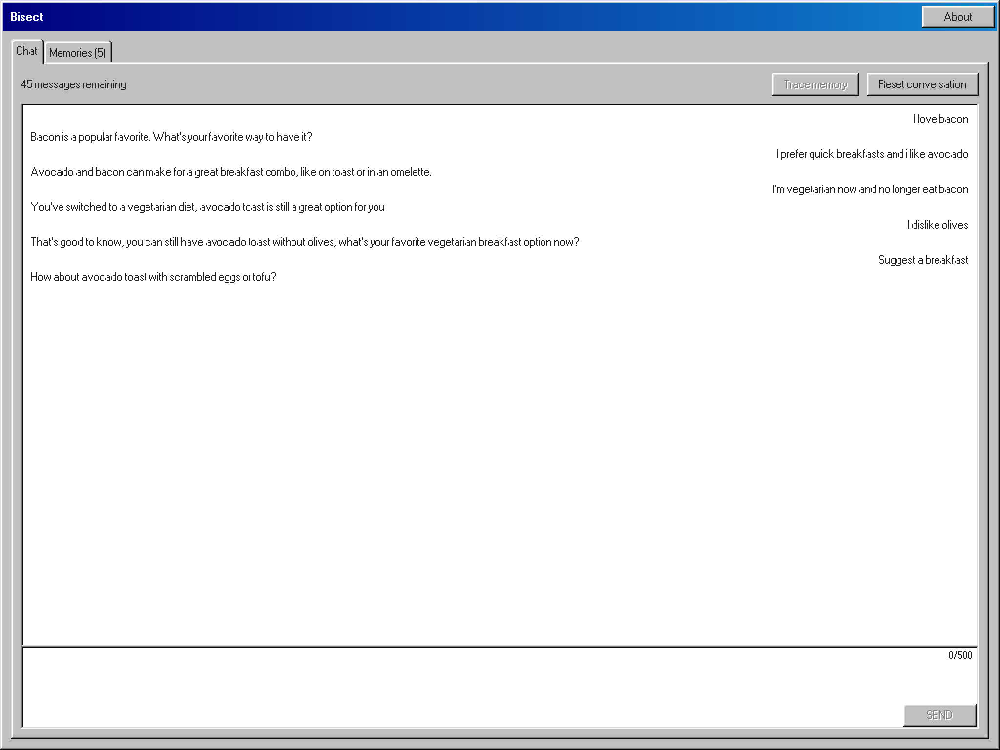
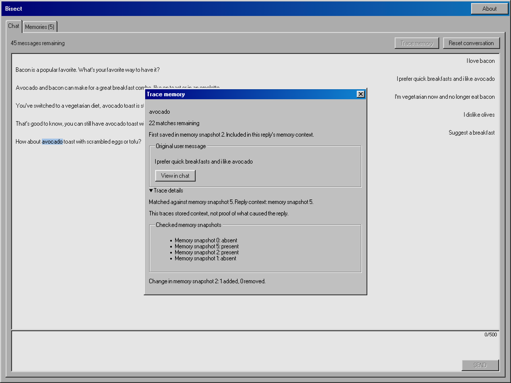

<h1 align="center">Bisect</h1>

Inspect and trace your agent's memory.

  

  

Select text in the agent's reply and click **Trace memory** to find a matching memory. Bisect searches saved memory snapshots to find where it first appeared and shows the original message.

Each successful chat turn saves your full message as a memory and takes a snapshot of all memories. You can browse your saved messages in the **Memories** tab. Corrections stay alongside earlier messages.

If no match is found, the trace stops. The reply may come from general model knowledge or reasoning, or the memory matching step may have missed a relevant memory. A trace shows the source of stored context; it doesn't prove why the model gave a particular answer.

#### License

Licensed under <a href="LICENSE">MIT license</a>.

 

Any contribution intentionally submitted for inclusion in this repository by you shall be licensed
under the MIT License, without any additional terms or conditions.

